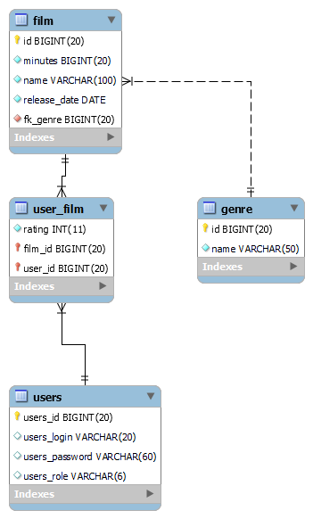

# 🎞 Sistema de filmes

Aplicação criada com o objetivo de praticar os meus conhecimentos em Spring Boot  

Utilizei do [springdoc](https://springdoc.org/) para documentar a API. Documentação disponível no endpoint "/swagger-ui/index.html"

---

👨‍🦲 Se trata de um sistema de filmes onde **2 tipos de usuários (USER e ADMIN)** podem se autenticar via [**JWT**](https://github.com/auth0/java-jwt) e realizar as seguintes operações:

* Permissões para USER:
    * Realizar login no sistema
    * Consultar filmes e gêneros disponíveis
    * Com base nos filmes disponíveis:
        * Adicionar filmes à sua lista
        * Dar avaliação (0-10) para os filmes da sua lista
        * Remover filmes da sua lista

* Permissões para ADMIN:
    * Todas de USER
    * Cadastrar novos usuários no sistema
    * CRUD de gêneros de filmes
    * CRUD de filmes
 
---

👮‍♂️ O banco de dados foi configurado a partir de anotações na própria aplicação, por meio do Hibernate (implementação do JPA usada pelo Spring Boot). Resultando na seguinte estrutura:  

